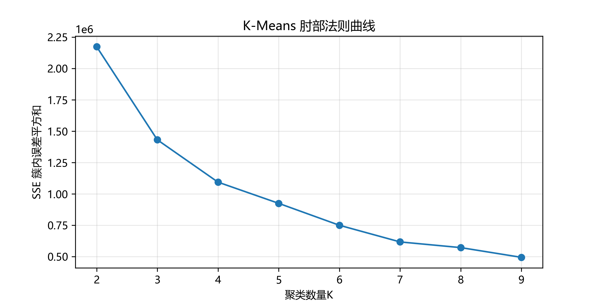
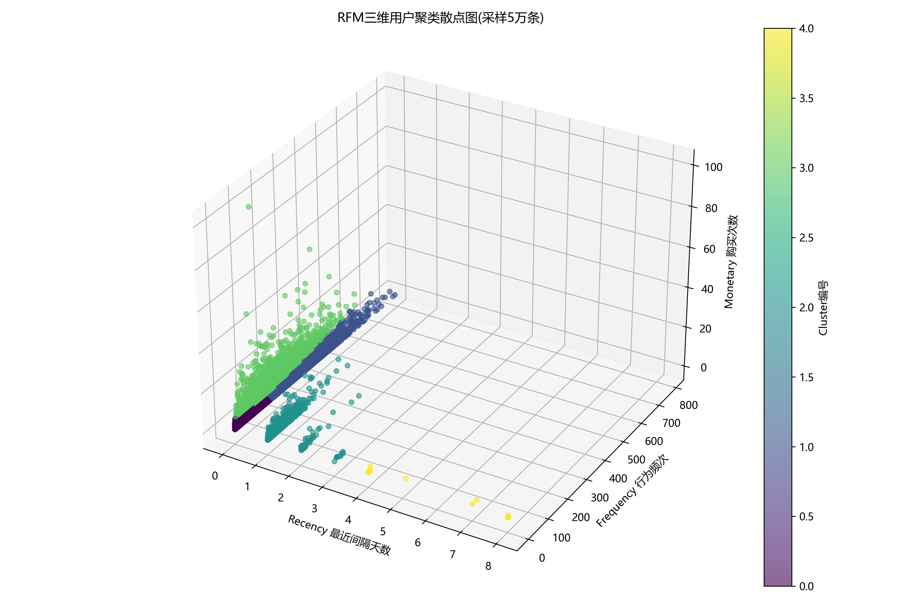
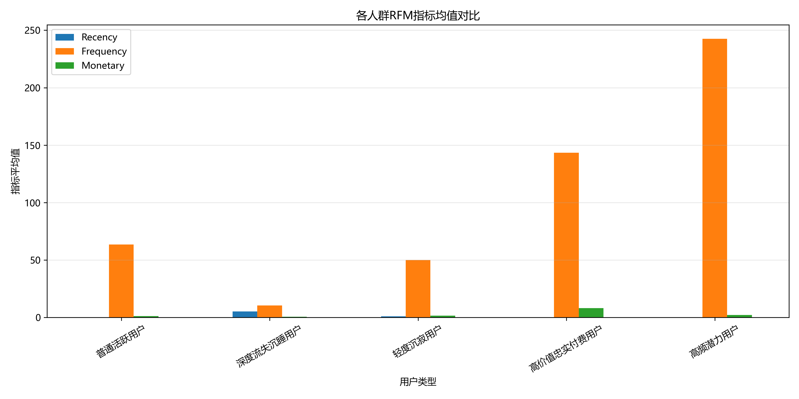
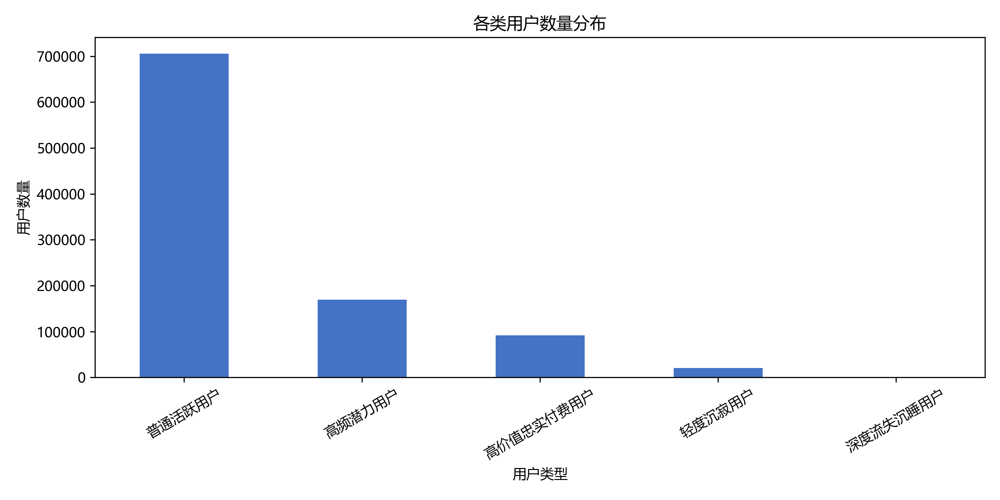

# 携程业务场景RFM用户分层建模

## 项目背景
携程旅游平台用户业务分析场景，搭建从原始数据处理到用户分群建模的完整分析流程。基于同步后的用户业务数据开展数据清洗、质量优化，构建RFM指标并使用K-Means算法完成用户价值分层。

## 数据集说明
数据源为模拟携程平台用户消费行为数据集，对应Binlog同步至携程云后的用户原始业务数据；
包含用户编号、消费时间、消费频次、消费金额等行为字段。
原始数据文件体积较大，不在仓库内上传，可通过模拟数据脚本生成测试数据集。

## 技术栈
Python｜Pandas｜NumPy｜Scikit-learn(K-Means)｜Matplotlib

## 项目流程
1. 数据预处理：使用`fillna`填充缺失数据，`drop_duplicates`清除重复记录；借助`numpy.percentile`结合IQR法则识别并过滤异常数据。
2. 特征构建：提取R(Recency)、F(Frequency)、M(Monetary)三类用户价值特征。
3. 聚类建模：基于RFM特征使用K-Means算法实现用户分群。
4. 结果可视化：输出多张分析图表，展示聚类选型、聚类分布、群体特征与用户数量统计。

## 聚类可视化结果
### 肘部法则（确定最优聚类数目）


### RFM三维聚类散点图


### 各用户群体指标对比


### 用户群体数量分布


## 运行方式
安装依赖
```bash
pip install -r requirements.txt
